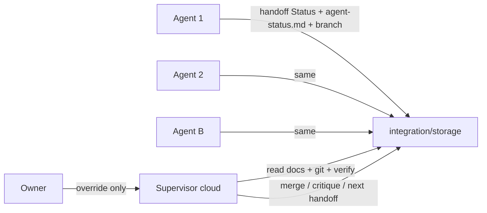

# Supervisor protocol — docs are the bus

**Owner rule (2026-07-09):** Agents coordinate through **repo docs + git**, not owner relay. The supervisor reads those signals and catches gaps. Owner only steps in when they notice something wrong.

---

## Communication model



| Channel | Who writes | Who reads |
|---------|------------|-----------|
| **Active handoff** (`agent-*-*.md`) | Implementer | Supervisor, next agent |
| **[`agent-status.md`](./agent-status.md)** | Every agent, each push | Supervisor (dashboard) |
| **Agent reports** (`reports/*.md`) | Module owner at session end | Supervisor, docs-release |
| **`integration-sync-*.md`** | Supervisor or agent stub | Everyone — merge context |
| **Git** (branch, commits, diff) | Implementer | Supervisor — ground truth |

**Not required:** owner pasting chat logs. Optional: owner flags mistakes; supervisor investigates via docs/git.

---

## What every agent writes (on each push)

### 1. Handoff `## Status` + `## Session log`

In the assigned handoff file:

- Check `[x]` slices with **evidence** (file path or test name), not vibes
- Append a **Session log** entry (see template in [`agent-status.md`](./agent-status.md))

### 2. Row on [`agent-status.md`](./agent-status.md)

Update your row: branch, commit SHA, slice, verification one-liner, **Gaps** (honest), blockers.

### 3. Git

Push branch. Supervisor uses:

```bash
git fetch origin integration/storage <branch>
git log --oneline origin/integration/storage..origin/<branch>
git diff --stat origin/integration/storage...origin/<branch>
pnpm run typecheck && pnpm test   # on branch tip before merge
```

Do **not** mark handoff complete without pushed commits and `agent-status.md` updated.

---

## Supervisor duties (no owner relay)

1. Read [`agent-status.md`](./agent-status.md) + active handoffs + [`integration-sync`](./integration-sync-2026-07-07.md)
2. Fetch branches; verify claims vs diff
3. Run typecheck/tests before merge (or trust CI if wired)
4. Mean critique in owner thread — what landed, what’s missing, merge hazards
5. Merge when green; update `agent-status.md` + integration-sync stub
6. Write **next session handoff** so agents never go idle without a doc target

Owner should not need to relay unless they spot a process failure.

---

## Agent roster (current)

### Cursor Cloud

| Agent | Handoff | Notes |
|-------|---------|-------|
| **1** | [`agent-01-session-2-storage-docs.md`](./agent-01-session-2-storage-docs.md) | Rebase onto tip before merge |
| **2** | [`agent-02-session-2-process-platform.md`](./agent-02-session-2-process-platform.md) | Rebase onto tip before merge |

### Local Claude — **B → A → C**

| Phase | Agent | Handoff |
|-------|-------|---------|
| **1** | **B** | [`agent-b-html-doc-platform.md`](./agent-b-html-doc-platform.md) |
| **2** | **A** | [`agent-a-html-standards-corpus.md`](./agent-a-html-standards-corpus.md) |
| **3** | **C** | [`agent-c-standards-audit.md`](./agent-c-standards-audit.md) |

Archived: Session 1 handoffs (merged). Index: [`reports/README.md`](./reports/README.md).

---

## Session log template (append to handoff file)

```markdown
### Session log YYYY-MM-DD HH:MM UTC

- **Branch:** `cursor/...` @ `abcdef1`
- **Slices done:** B, C — …
- **Verification:** typecheck OK; N tests passed
- **Gaps:** …
- **Blockers:** none | …
```
