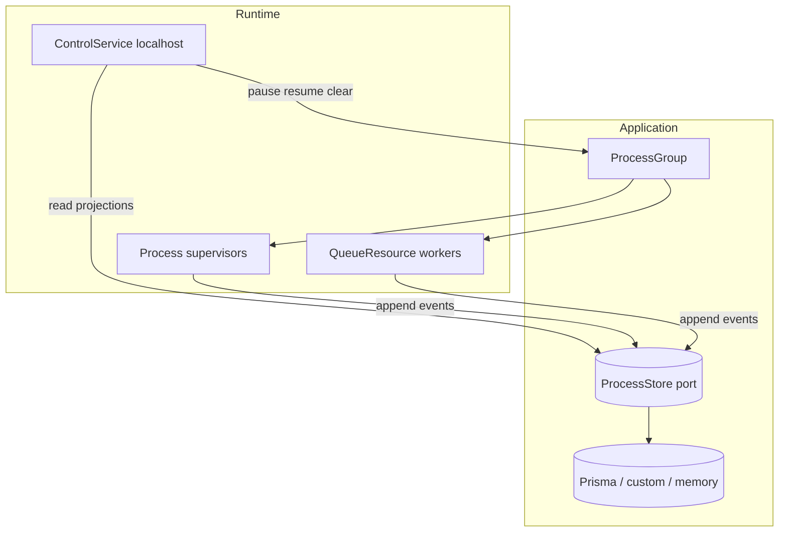

# 10 — Agent implementation roadmap (meta)

## Purpose (read this first)

This document is for **agents and maintainers** implementing the numbered plans
**01–09** in [`README.md`](./README.md). It is **not** a substitute for those
plans: it **stitches them into an execution order**, ties them to **current
source anchors**, and provides **illustrative TypeScript** for target shapes.

**Rules:**

- Code blocks here are **design targets** unless they cite `src/` with line
  references. They may not compile verbatim.
- Implemented, contractual behavior still belongs in regular `docs/` and
  source TSDoc; graduate plans out of `docs/plans` when done.
- Follow [`../AGENTS.md`](../AGENTS.md) invariants (supervisor semantics, typing,
  `127.0.0.1` control binding, no `repos/` imports).

---

## Current anchors in the codebase

| Concern | Primary files |
| ------- | ------------- |
| Store port (append + process reads) | `src/ProcessStore.ts` (`ProcessStoreInterface`) |
| Queue public API + contexts + config | `src/QueueResource.ts` (`QueueHandle`, `EffectContext`, `HandlerContext`, `QueueResourceConfig`) |
| Prisma store adapter | `src/prisma/PrismaProcessStore.ts`, `src/prisma/codec.ts` |
| Group + control | `src/ProcessGroup.ts`, `src/ControlService.ts` |

---

## End-state narrative

1. **Runtime** (`Process`, `QueueResource`, `ProcessGroup`) keeps the same
   outward responsibilities: supervisors, queue workers, localhost control.
2. **Operational truth** flows through **`ProcessStore`**: append-only events
   plus **typed reads** for queues and processes (plan **01**, **03**).
3. **`QueueResource`** converges on **one queue-bound control concept** with
   **views** for public handle vs effect vs hooks; optional **schema** validation
   on every enqueue path; **release/handoff** as typed operations (plan **02**).
4. **`persist` / `refill`** stop being the primary storage story; durable queue
   behavior uses **store events** and/or **hooks with controls** (plan **01**,
   **02**).
5. **`ControlService`** grows toward **resource-shaped routes** and optional
   streaming, still **localhost-first** (plan **05**, invariant **127.0.0.1**).
6. **Schedules** gain **stable IDs** and clear removal semantics (plan **04**).
7. **`anyUnknownInErrorContext`** returns when boundaries are clean (plan **09**).



---

## Phase A — Event model expansion (plans 01 + 03)

**Goal:** extend the closed `AnalyticsEvent` union (or successor) so queues have
the same “auditability” as processes: enqueued, rejected, release, richer item
lifecycle.

Illustrative **new** event shapes (names subject to alignment with existing
`queue.item.completed` / `queue.lifecycle.changed` in `ProcessStore.ts`):

```typescript
import type { AnalyticsEventBase } from "@nikscripts/effect-pm";

export interface QueueEnqueueRejectedEvent extends AnalyticsEventBase {
  type: "queue.item.enqueue_rejected";
  entityType: "queue";
  rejection: {
    readonly operation: "add" | "prioritize" | "defer" | "enqueue" | "release_import";
    readonly reasonTag: "schema" | "duplicate_key" | "shutdown" | "capacity" | "other";
    readonly diagnostics?: string;
    readonly payloadSummary?: unknown;
  };
}

export interface QueueItemEnqueuedEvent extends AnalyticsEventBase {
  type: "queue.item.enqueued";
  entityType: "queue";
  item: {
    readonly priority: "high" | "normal" | "low";
    readonly attempts: number;
    readonly enqueuedAt: number;
    readonly key?: string;
  };
}

export interface QueueReleaseRequestedEvent extends AnalyticsEventBase {
  type: "queue.release.requested";
  entityType: "queue";
  release: {
    readonly targetQueueName: string;
    readonly releaseId: string;
    readonly itemCount: number;
  };
}
```

**Append helper pattern** (use `Clock` for `occurredAt`, stable UUIDs for `id`):

```typescript
import { Clock, Effect } from "effect";
import type { ProcessStoreInterface } from "@nikscripts/effect-pm";

type StoreEvent = import("@nikscripts/effect-pm").AnalyticsEvent; // grows over time

export const appendWithClock =
  (store: ProcessStoreInterface, event: Omit<StoreEvent, "id" | "occurredAt">) =>
    Effect.gen(function* () {
      const occurredAt = yield* Clock.currentTimeMillis;
      const id = yield* Effect.sync(() => crypto.randomUUID());
      yield* store.append({ ...event, id, occurredAt } as StoreEvent);
    });
```

**Exit criteria:** new discriminators appear in `ProcessStore.ts`, Prisma
`encodeEvent` / `decodeEventRow` understand them, tests assert append payloads.

---

## Phase B — `ProcessStoreInterface` queue reads (plans 01 + 03)

**Goal:** mirror process reads with queue reads so CLIs and `ControlService` do
not poke private queue state.

Target port **extension** (illustrative; event types from Phase A above):

```typescript
import { Effect } from "effect";
import type {
  AnalyticsEvent,
  ProcessExecutionCompletedEvent,
  ProcessLifecycleChangedEvent,
  QueryOpts,
  QueueLifecycleChangedEvent,
} from "@nikscripts/effect-pm";

/** Shapes defined in Phase A; export from `src/ProcessStore.ts` when implemented. */
interface QueueItemEnqueuedEvent {
  readonly type: "queue.item.enqueued";
}

/** Shapes defined in Phase A; export from `src/ProcessStore.ts` when implemented. */
interface QueueEnqueueRejectedEvent {
  readonly type: "queue.item.enqueue_rejected";
}

export interface QueueSummary {
  readonly queueId: string;
  readonly pendingHigh: number;
  readonly pendingNormal: number;
  readonly pendingLow: number;
  readonly completed: number;
  readonly paused: boolean;
  readonly shutdown: boolean;
}

export interface StoreEventQuery {
  readonly entityType?: "process" | "queue";
  readonly entityId?: string;
  readonly types?: ReadonlyArray<string>;
  readonly opts?: QueryOpts;
}

export interface ProcessStoreInterfaceV2 {
  append: (event: AnalyticsEvent) => Effect.Effect<void>;
  appendBatch: (events: ReadonlyArray<AnalyticsEvent>) => Effect.Effect<void>;
  getProcessExecutions: (
    processId: string,
    opts?: QueryOpts,
  ) => Effect.Effect<ReadonlyArray<ProcessExecutionCompletedEvent>>;
  getProcessLifecycle: (
    processId: string,
    opts?: QueryOpts,
  ) => Effect.Effect<ReadonlyArray<ProcessLifecycleChangedEvent>>;

  getQueueItems: (queueId: string, opts?: QueryOpts) => Effect.Effect<ReadonlyArray<QueueItemEnqueuedEvent>>;
  getQueueLifecycle: (queueId: string, opts?: QueryOpts) => Effect.Effect<ReadonlyArray<QueueLifecycleChangedEvent>>;
  getQueueEnqueueRejections: (queueId: string, opts?: QueryOpts) => Effect.Effect<ReadonlyArray<QueueEnqueueRejectedEvent>>;
  getQueueSummary: (queueId: string) => Effect.Effect<QueueSummary>;

  /** Optional v1 escape hatch before dedicated projections land */
  events: (query: StoreEventQuery) => Effect.Effect<ReadonlyArray<AnalyticsEvent>>;
}
```

**In-memory store** should reuse the same filtering/sorting approach as
`applyQueryOpts` in `ProcessStore.ts`.

**Exit criteria:** memory + Prisma implementations satisfy the expanded
interface; graduation per [01-process-store-service.md](./01-process-store-service.md).

---

## Phase C — Unified `QueueControls` and schema (plan 02)

**Goal:** one backing implementation; `QueueHandle` / effect context / hook context
as **views**; overloads for `add` / `prioritize` / `defer` / `enqueue(entry)`;
`ItemE` / `BatchE` are `never` without schema.

```typescript
import { Effect } from "effect";
import type { Schema } from "effect";

export interface EnqueueEntry<T> {
  readonly item: T;
  readonly priority?: "high" | "normal" | "low";
  readonly key?: string;
  readonly attempts?: number;
  readonly enqueuedAt?: number;
  readonly attributes?: Record<string, unknown>;
}

export interface QueueControls<T, R, E, ItemE, BatchE> {
  readonly add: {
    (item: T): Effect.Effect<void, ItemE>;
    (items: ReadonlyArray<T>): Effect.Effect<void, BatchE>;
  };
  readonly prioritize: {
    (item: T): Effect.Effect<void, ItemE>;
    (items: ReadonlyArray<T>): Effect.Effect<void, BatchE>;
  };
  readonly defer: {
    (item: T): Effect.Effect<void, ItemE>;
    (items: ReadonlyArray<T>): Effect.Effect<void, BatchE>;
  };
  readonly enqueue: {
    (entry: EnqueueEntry<T>): Effect.Effect<void, ItemE>;
    (entries: ReadonlyArray<EnqueueEntry<T>>): Effect.Effect<void, BatchE>;
  };
  readonly pause: Effect.Effect<void>;
  readonly resume: Effect.Effect<void>;
  readonly shutdown: Effect.Effect<void>;
  readonly clear: Effect.Effect<number>;
  readonly size: Effect.Effect<number>;
  readonly sizes: Effect.Effect<{ high: number; normal: number; low: number }>;
  readonly isEmpty: Effect.Effect<boolean>;
  readonly completed: Effect.Effect<number>;
}

/** When `S` is a schema, decode failures surface as `ParseResult.ParseError`; else `never`. */
export type ItemEnqueueError<S> = [S] extends [Schema.Schema.Any]
  ? import("effect").ParseResult.ParseError
  : never;
```

Single **validation choke-point** inside `makeQueueEffect` (see
`normalizeEnqueueInput` today):

```typescript
import { Effect, Schema } from "effect";

export const decodeItem =
  <T, S extends Schema.Schema<T, unknown, never>>(schema: S, raw: unknown) =>
    Schema.decodeUnknown(schema)(raw);

export const decodeBatch = <T, S extends Schema.Schema<T, unknown, never>>(
  schema: S,
  raws: ReadonlyArray<unknown>,
) =>
  Effect.forEach(raws, (raw, index) =>
    Effect.mapError(decodeItem(schema, raw), (e) => ({ index, e })),
  );
```

**Migration:** `QueueResourceConfig.persist` / `refill` → store-backed events
and/or `hooks.onEmpty` with **queue-bound controls** (plan **02**). Prefer a
semver-major boundary or explicit deprecation window; add a **changeset** when
releasing.

---

## Phase D — Runtime wiring (QueueResource ↔ ProcessStore)

**Enqueue pipeline** (conceptual):

```typescript
import { Effect, Option } from "effect";

export const enqueuePipeline =
  <T, E>(deps: {
    readonly queueName: string;
    readonly store: Option.Option<{ append: (e: unknown) => Effect.Effect<void> }>;
    readonly validate?: (item: T) => Effect.Effect<T, E>;
    readonly offer: (item: T, priority: "high" | "normal" | "low") => Effect.Effect<void>;
  }) =>
  (raw: T, priority: "high" | "normal" | "low") =>
    Effect.gen(function* () {
      const item =
        deps.validate === undefined ? raw : yield* deps.validate(raw);

      if (Option.isSome(deps.store)) {
        // Append durable / analytics event *before* bounded-queue offer when ordering matters
        yield* deps.store.value.append(/* QueueItemEnqueuedEvent */);
      }

      yield* deps.offer(item, priority);
    });
```

**Rejected path** must append `queue.item.enqueue_rejected` when observable
(schema, shutdown, capacity, duplicate key).

---

## Phase E — Control service v2 (plan 05)

Keep **localhost / 127.0.0.1** binding. Add routes that **delegate** to
`ProcessGroup` for mutations and **`ProcessStore` reads** for inspection.

Illustrative route surface:

```typescript
import { Effect } from "effect";

export interface ControlRoutesV2 {
  readonly "GET /health": Effect.Effect<{ ok: true }>;
  readonly "GET /queues": Effect.Effect<ReadonlyArray<{ name: string; summary: QueueSummary }>>;
  readonly "GET /queues/:name": Effect.Effect<QueueSummary>;
  readonly "GET /queues/:name/rejections": Effect.Effect<ReadonlyArray<QueueEnqueueRejectedEvent>>;
}
```

Later: **SSE** or streaming from `events` / `eventsStream` (plan **05**).

---

## Phase F — Schedule identity (plan 04)

Introduce **stable string IDs** for mutable schedule entries; on `remove(id)`:
interrupt matching sleepers, let in-flight instances observe removal, prevent new
instances for removed IDs. Do **not** silently make `ProcessStore` the schedule
database (see plan **04** and **01** “Schedule persistence boundary”).

```typescript
export interface ProcessScheduleEntryV2 {
  readonly id: string;
  // ...arm windows, labels, etc. — align with ProcessSchedule module
}
```

---

## Phase G — Strict Effect LS rule (plan 09)

When queue/store/control boundaries no longer rely on `unknown` in error
channels, re-enable `anyUnknownInErrorContext` per
[09-strict-any-unknown.md](./09-strict-any-unknown.md).

---

## Suggested slice order (minimize rework)

| Slice | Outcome | Plans |
| ----- | ------- | ----- |
| G1 | New queue/process-related events + append sites | 01, 03 |
| G2 | Memory `ProcessStore` queue reads + `events(query)` | 01, 03 |
| G3 | Prisma codec + SQL for new types and reads | 01, 03 |
| G4 | `QueueControls` views + `enqueue(entry)` + schema errors | 02 |
| G5 | Remove or deprecate `persist` / `refill` default path | 01, 02 |
| G6 | Control routes using reads | 05 |
| G7 | Schedule IDs + removal cleanup | 04 |

---

## Verification commands

From repo root:

```bash
pnpm run typecheck
pnpm test
pnpm run lint
pnpm run build
```

---

## Changesets and semver

Whenever public types (`ProcessStoreInterface`, `QueueHandle`, `AnalyticsEvent`,
`QueueResourceConfig`) or runtime behavior change in a user-visible way,
prepare a **changeset** before release. Major bumps are likely if `persist` /
`refill` are removed without a compatibility layer.

---

## Related numbered plans

| Plan | Link |
| ---- | ---- |
| 01 | [ProcessStore as the storage service](./01-process-store-service.md) |
| 02 | [Queue controls, schema, handoff, and hooks](./02-queue-controls-and-hooks.md) |
| 03 | [Queue analytics v2](./03-queue-analytics-v2.md) |
| 04 | [Schedule identity and persistence](./04-schedule-identity-and-persistence.md) |
| 05 | [Control service v2](./05-control-service-v2.md) |
| 06 | [Process lifecycle hooks](./06-process-lifecycle-hooks.md) |
| 07 | [ProcessManager](./07-process-manager.md) |
| 08 | [Lifecycle machine](./08-lifecycle-machine.md) |
| 09 | [Strict any/unknown](./09-strict-any-unknown.md) |
