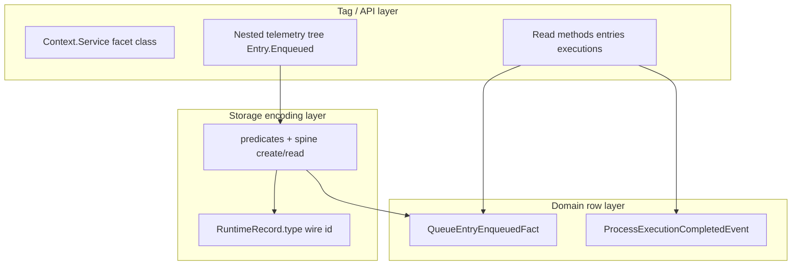

# 17 — Facet telemetry factory rewrite

**Status:** design / implementation plan (May 2026). **Facet emit DX is not finalized** —
§5 is a **draft** for review; §5.8 is the sign-off checklist. Slice order in §14 assumes
§5.8 is checked. Scope: [18-resource-state-scope.md](./18-resource-state-scope.md).

**Policy:** breaking changes OK. **Delete** replaced APIs — no `@deprecated`, no shims, no
dual `record` + `telemetry` on the same facet.

**Related:** [STORAGE.md](../STORAGE.md), [12](./12-runtime-identity-and-singleton-runs.md),
[13](./13-queue-rate-limit-and-operational-storage.md), [06](./06-runtime-hooks-config.md).

**Note:** Exploratory code on `cursor/facet-telemetry-158c` holds the **golden RunResource
tree DSL** — port onto **`Telemetry.Tag` + `Wiring.sections` + `Telemetry.layer`** after
[telemetry-split-bake.md](../recipes/telemetry-split-bake.md); do not merge the branch
wholesale into hub work.

---

## 1. Problem

Today each built-in facet duplicates the same concepts in four places:

| Concept | Where it leaks today |
|--------|----------------------|
| Wire string (`RuntimeRecord.type`) | `EXECUTION_TYPE`, `queue.entry.enqueued`, `queueEntryFactTypes[]`, codecs, STORAGE.md |
| Emit API | `recordEntry(fact)`, `recordCompleted(input)` — caller passes payload already in context |
| Type-level facet shape | Phantom `__processStoreEmit` / `__processStoreRead` brands |
| Optional static emitters | Flat `Facet.recordX(...)` unrelated to read tree naming |

Call sites in `Process.ts` / `QueueResource.ts` thread `processId`, `queueId`, timestamps
into helpers that restate what the kernel already knows. `AnalyticsEventBase.type: string`
widens literal wire types on decoded events.

Agreed direction: **telemetry-first facets** — one declaration defines tag path, wire id,
and generated storage (+ optional fan-out). Payload from **`State.Scope`** at emit time
(see §5); `RuntimeEmitContext` demoted to cross-cutting only (§6).

---

## 2. Goals

1. **Single source of truth per event** — tag + event name → wire id + codec + nested API path.
2. **Effect-shaped factory** — mirror Effect v4 `Context.Service` (`Service`, `Shape`, `Type`
   namespace extractors); no author DAA on facet class bodies.
3. **Nested PascalCase API** — `ProcessExecutionStore.Execution.Completed` on the facet class
   (static tree); instance `yield* store` mirrors paths when composed.
4. **Scope-stamped writes** — kernel installs [`State.Scope`](./18-resource-state-scope.md)
   (`ProcessScope.run`, …); generated emit reads scope + `Clock` for terminal fields. **Not**
   `ProcessExecutionFinishInput`, not `withRuntimeEmitContext` for resource-owned ids.
5. **Queries unchanged in spirit** — `query((s) => ({ entries, ... }))` stays; projections over
   append-only log, not a separate “catalog”.
6. **Delete old surface** — remove `ProcessStore.record`, flat `record*` methods, duplicate
   wire const arrays, identifier-bound **write** methods, `__processStore*` brands.

Non-goals for this plan:

- Public spine `Context` service (stays `src/internal/store/spine.ts`).
- Resurrecting `OperationalStateStore`, `CustomEventStore`, app-level `ProcessStore.recordEvent`.
- Backward-compatible wire strings (breaking migration in one release is fine).

---

## 3. Architecture (three layers)

Do not conflate:



| Layer | Owns |
|-------|------|
| **Tag / API** | `ProcessStore.Service` class, nested emit Effects, read methods, `for(id)` |
| **Domain** | Fact/change/event interfaces, decoders, query types |
| **Storage** | `make*Record`, `*Predicates`, wire string literals used in encoders |

---

## 4. Wire id rules (breaking)

**Format:** dot-separated PascalCase path from telemetry tree:

```
{Namespace}.{Tag}.{Tag}.{Event}
```

Examples (new canonical strings):

| Old | New |
|-----|-----|
| `process.execution.completed` (all statuses) | `Process.Execution.Completed` / `.Failed` / `.Interrupted` |
| `queue.entry.enqueued` | `Queue.Entry.Enqueued` |
| `queue.lifecycle.started` | `Queue.Lifecycle.Started` |
| `log.entry` | `Log.Entry.Recorded` (exact leaf names per facet audit) |

**Derivation at build time:**

```ts
telemetryWireId(namespace, tagPath, eventName)
// "Process" + ["Execution"] + "Completed" → "Process.Execution.Completed"
```

- **Namespace** — `Telemetry.namespace("Queue")` or derived from facet id slug (rule:
  pick one algorithm in implementation; document in STORAGE.md).
- **Tag path** — `Telemetry.tag("Entry")` or `Telemetry.tag("Worker", "Wake")`.
- **Event** — `Telemetry.event("Enqueued", options)` — name is PascalCase; wire uses
  as-is (no duplicate string arg).

Facet module may export `ProcessExecutionStore.Wire` const map for tests/decoders only if
needed — generated from the same tree, not hand-maintained duplicates.

---

## 5. Facet & emit DX (draft — conversation May 2026)

**Do not treat as shipped** until **§5.8** is checked off. Older examples elsewhere in this
file may still show `read`, `withIdentifier`, `store:`, `fromScope`, or tag `scope:` — obsolete.

### 5.1 Imports

```ts
import { ProcessStore, Telemetry } from "@nikscripts/effect-pm/ProcessStore"
import { ProcessScope } from "@nikscripts/effect-pm/process/ProcessScope" // path TBD
```

- **`Telemetry`** — sibling export: `namespace`, `tag`, `event`, **`Telemetry.Schema`**.
- Never `ProcessStore.Telemetry.*`.

### 5.2 Facet declaration (authors write)

**Builder sections (renamed):**

| Section | Role |
|---------|------|
| `ProcessStore.telemetry(...)` | Nested emit tree |
| `ProcessStore.query((s) => ({ ... }))` | Instance query API (`yield* store`) |
| `ProcessStore.for((id, s) => ({ ... }))` | Identifier-bound queries → `Facet.for(id)` |

**No author `store:` on events.** No `fromScope`. No `scope:` on tags — scope lives on
**`Telemetry.Schema`**.

**Event payload** — `Telemetry.Schema` (mirror `Schema.Class`; scope required).
Alias scope schema entry points locally to keep declarations readable:

```ts
const ProcessState = ProcessScope.Schema.State

class ProcessExecutionCompleted extends Telemetry.Schema<ProcessExecutionCompleted>()(
  ProcessScope,
)({
  processId: ProcessState.processId,
  scheduleKey: ProcessState.scheduleKey,
  startedAt: ProcessState.startedAt,
  isStartupRun: ProcessState.isStartupRun,
  completedAt: Telemetry.terminal.clockMillis,
  status: Schema.Literal("completed"),
}) {}
```

**Facet:**

```ts
export class ProcessExecutionStore extends ProcessStore.Service<ProcessExecutionStore>()(
  "@nikscripts/effect-pm/store/processExecution/ProcessExecutionStore",
  ProcessStore.telemetry(
    Telemetry.namespace("Process"),
    Telemetry.tag("Execution")(
      Telemetry.event("Completed", ProcessExecutionCompleted).pipe(
        Telemetry.logWarning(
          "ProcessExecutionStore write failed for completed run",
          ({ processId }) => ({ processId }),
        ),
      ),
      Telemetry.event("Failed", ProcessExecutionFailed).pipe(
        Telemetry.logWarning(
          ({ processId }) => `ProcessExecutionStore write failed for failed run "${processId}"`,
          ({ processId }) => ({ processId }),
        ),
      ),
      Telemetry.event("Interrupted", ProcessExecutionInterrupted),
    ),
  ),
  ProcessStore.query((s) => ({
    executions: (q) => readProcessExecutions(s, q),
    hasPriorExecutions: (processId) => readHasPriorExecutions(s, processId),
  })),
  ProcessStore.for((processId, s) => ({
    executions: (q) => readProcessExecutions(s, { ...q, processId }),
    hasPriorExecutions: () => readHasPriorExecutions(s, processId),
  })),
) {}
```

| API | Role |
|-----|------|
| `Telemetry.event(name, schema)` | Second arg is **only** a `Telemetry.Schema` class (or interim legacy `{ store }` until slice 2). |
| `Telemetry.event(...).pipe(...)` | Fan-out legs (`logWarning`, `span`, …) receive the **materialized row** from schema pick + terminals. Phase 1: store leg + warning logs. |
| `Telemetry.tag("Entry")` | Wire/API path only — **no** `scope:` option. |
| Scope field schemas | `ProcessScope.Schema.Leaf.*` (current level) and `ProcessScope.Schema.State.*` (full nested yielded state) — normal Effect field schemas + pickup metadata (see plan 18). |
| Terminals | `Telemetry.terminal.*` or plain `Schema.*` without scope binding (`Clock`, `Failed(error)`). |

`Telemetry.logWarning` accepts either static values or callbacks over the materialized event:

```ts
Telemetry.logWarning("Run storage write failed", { component: "RunResourceStore" })
Telemetry.logWarning(
  ({ runId }) => `Run ${runId} storage write failed`,
  ({ runId, resourceId }) => ({ runId, resourceId }),
)
```

### 5.2.1 Deferred helper decisions

Keep the current Effect-style builder DSL. Do **not** add `Telemetry.define(...)`;
multiple authoring styles make edits less predictable.

Add these now:

- `Telemetry.Type.Wire<TelemetryDef>` — type union of all PascalCase wires in a
  telemetry definition.
- `Telemetry.Type.Event<TelemetryDef, "Tag">` — type union of event wires for
  a tag.
- `Telemetry.events(def, tag?)` — runtime wire arrays derived from the
  telemetry definition for query predicates.

Defer these until separate recipes settle the API:

- `Telemetry.match(...)` / `matchTag(...)` — should take inspiration from
  Effect's match APIs before implementation.
- `Telemetry.index(...)` — needed for queue `subjectId` / `key` / `indexA-B`,
  but needs a dedicated Queue indexing recipe.
- `Telemetry.batch(...)` — desired, but the first implementation destabilized
  event type inference; revisit after definition-derived type helpers are
  stable.
- `Telemetry.project(...)` and `Telemetry.codec(...)` — too much DSL until
  repeated decoder pain is obvious.

Schema reuse rule: identical payload schemas should be shared. Event names carry
wire identity; schemas only describe event payload shape.

**Deletes:** `ProcessStore.read`, `ProcessStore.withIdentifier`, `Facet.withIdentifier`,
`fromScope`, per-event options bags, tag-level `scope:`.

### 5.3 Emit tree shape (static + instance)

Attached to the facet class (e.g. `ProcessExecutionStore.Execution`):

| Event | Static / nested type | Call site |
|-------|----------------------|-----------|
| **Completed** | `Effect<void, E, R>` — **a value, not a thunk** | `onSuccess: ProcessExecutionStore.Execution.Completed` — **never** `() => Completed` when `Completed` is already an `Effect` |
| **Failed** | `(error: unknown) => Effect<void, E, R>` | `onFailure: (error) => ProcessExecutionStore.Execution.Failed(error)` — **only** kernel arg on this path |
| **Interrupted** | TBD — likely same as Completed or zero-arg | |

**Optional layer (no store composed):** static emits are silent no-ops (same as today’s
optional `record*` behavior). Instance `yield* store` still exposes the same paths when
the facet service exists.

**Instance** (when `yield* ProcessExecutionStore`):

```ts
const store = yield* ProcessExecutionStore
yield* store.Execution.Completed
yield* store.Execution.Failed(error)
```

Prefer **static** `ProcessExecutionStore.Execution.*` in kernels that already use
`Effect.serviceOption` / optional analytics — supervisor does not need a store binding
to call the static tree.

**Rejected emit shapes**

- `ProcessStore.Telemetry.*` nested under `ProcessStore`
- Separate `const { store, telemetry } = yield* …` — tree lives on the **facet class**
- `recordCompleted(finishInput)` / `recordFailed(finishInput)`
- Wrapping a constant Effect: `onSuccess: () => ProcessExecutionStore.Execution.Completed`

### 5.4 Generated emit body (internal)

Pseudocode for `Execution.Completed`:

```ts
Effect.gen(function* () {
  const scope = yield* ProcessScope
  const completedAt = yield* Clock.currentTimeMillis
  const payload = encodeCompleted({ ...materializeSchemaFields(scope), completedAt, status: "completed", … })
  const spine = yield* /* facet make */
  yield* spine.create(makeProcessExecutionRecord(payload))
})
```

Pseudocode for `Execution.Failed(error)`:

```ts
(error: unknown) =>
  Effect.gen(function* () {
    const scope = yield* ProcessScope
    const completedAt = yield* Clock.currentTimeMillis
    const payload = encodeFailed({
      ...materializeSchemaFields(scope),
      completedAt,
      error: String(error),
      status: "failed",
      …
    })
    yield* spine.create(…)
  })
```

Fan-out legs (`span`, `annotate`, `metrics`, `debug`) wrap the store leg in later phases —
types may include stubs; **phase 1 = store leg only**.

### 5.5 Reference kernel (`Process.ts` — canonical)

This is the target `trackedProgram` after scope + factory land. Logging belongs on
the event definition (`Telemetry.logWarning(...)`), not in this kernel.

```ts
const trackedProgram = (
  scheduleIdentifier: Option.Option<string>,
  controls: ProcessScheduleControls,
): Effect.Effect<void, never, RUser> =>
  Effect.gen(function* () {
    const startedAt = yield* Clock.currentTimeMillis
    const isStartupRun = !(yield* hasPriorExecutions(name))

    yield* ProcessScope.run(
      {
        processId: name,
        scheduleKey: Option.getOrNull(scheduleIdentifier),
        startedAt,
        isStartupRun,
      },
      Effect.matchEffect(
        userEffect.pipe(
          Effect.provideService(ProcessScheduleContextTag, { id: scheduleIdentifier }),
          Effect.provideService(ProcessScheduleControlsTag, controls),
        ),
        {
          onFailure: (error) => ProcessExecutionStore.Execution.Failed(error),
          onSuccess: ProcessExecutionStore.Execution.Completed,
        },
      ),
    )
  })
```

**Deletes from supervisor:** `finishInput`, `executionEmitContext`, `withRuntimeEmitContext`,
`recordExecutionCompleted`, `recordExecutionFailed`.

`ProcessScope` shape and `ProcessScope.run` — [18-resource-state-scope.md](./18-resource-state-scope.md) §4.2 (use **`run`** for bracket-shaped ticks).

### 5.6 `RuntimeEmitContext` (narrowed)

See §6. Cross-cutting only (`groupId`, `traceId`, `processType` when not on scope). **Not**
the primary stamp for `processId` / `scheduleKey` / execution timestamps once scope is wired.

### 5.7 Anti-patterns (do not ship)

- Per-event `store: (s) => Effect.gen` in facet modules
- Nested `ProcessScope.provide` on success/failure copying the same state blob
- `RuntimeEmitContext.with` + zero-arg emit for fields that belong on `ProcessScope`
- `onSuccess: () => SomeEffect` when `SomeEffect` is already an `Effect` value
- Hand-maintained wire const arrays duplicating the telemetry tree

### 5.8 Facet DX sign-off checklist (required before slice 2+)

Mark each line **yes / no / revise** in review. Until this passes, §5 is **draft only**.

| # | Decision | Draft proposal (§5) | Alternatives |
|---|----------|---------------------|--------------|
| A | **Imports** — `Telemetry` sibling; `ProcessStore.telemetry` only wrapper | §5.1 | Nested `ProcessStore.Telemetry` |
| B | **Author never writes `store:`** — codegen owns spine leg | §5.2 | Keep author `store` for escape hatch |
| C | **Scope on `Telemetry.Schema` only** — not on tag | §5.2 | Tag-level `scope:` |
| D | **Event row = `Telemetry.Schema(scope)(fields)`** — no `fromScope` | §5.2 | Manual encoders / field lists |
| D2 | **`Telemetry.event(name, schema)`** — schema-only second arg | §5.2 | `{ schema, fromScope, store }` options |
| D3 | **Fan-out via `.pipe()`** on event def | §5.2 | Options on `Telemetry.event` |
| D4 | **`ProcessStore.query` + `ProcessStore.for`** | §5.2 | `read` / `withIdentifier` |
| E | **Emit tree on facet class** — `ProcessExecutionStore.Execution.*` | §5.3 | Separate `telemetry` object from `yield* store` |
| F | **`Completed` = `Effect` value** — `onSuccess: …Completed` (no `() =>`) | §5.3 | `() => Effect` thunk when layer optional |
| G | **`Failed` = `(error) => Effect`** — only call-site arg on failure path | §5.3 | Strict zero-arg; error only in scope patch |
| H | **Terminal fields** — `completedAt` / `durationMs` from `Clock` in codegen; not in `ProcessScope` state at tick start | §5.4 | Put `completedAt` on scope via re-provide |
| I | **Static emit for optional analytics** — silent no-op without store layer | §5.3 | Require `yield* store` in kernel |
| J | **Instance tree** — `yield* store` mirrors same paths when composed | §5.3 | Static only |
| K | **Kernel reference** — §5.5 `ProcessScope.run` + match branches | §5.5 | Different Process shape |
| L | **Queue entry events** — zero-arg `Effect` when scope is `EntryScope`? | §7.2 (open) | Per-event args for entry payload |
| M | **Fan-out phase 1** — store leg only; span/metrics later | §5.4 | All legs in v1 |
| N | **Delete** — `record*`, `FinishInput`, execution `withRuntimeEmitContext` for row fields | §11 | Deprecate first |

**Agreed in conversation (needs explicit yes on row):** B, E, F, G, K, and rejection of nested
scope re-provide (§5.7). **Not agreed yet:** L (queue zero-arg), H (exact terminal field source),
F vs optional-layer thunk shape, C for facets without scopes yet.

After sign-off: rename §5 title to “Facet & emit DX (finalized)” and check §14 slice 0.

---

## 6. `RuntimeEmitContext`

**Module:** `src/RuntimeEmitContext.ts` (public).

**Mechanism:** scoped merge via `Effect.provideService` (or fiber-local equivalent that
typechecks cleanly in Effect 4.0 — prefer idiomatic `Context` + `Effect.locally` pattern
from vendored `repos/effect/`).

```ts
interface RuntimeEmitContextShape {
  groupId?: string
  processType?: "process" | "queue-resource" | "run-resource" | "app"
  processId?: string
  instanceId?: string
  scheduleKey?: string | null
  subjectType?: string
  subjectId?: string
  traceId?: string
  spanId?: string
  // per-tick / per-item fields consumed by built-in encoders:
  startedAt?: number
  completedAt?: number
  isStartupRun?: boolean
  error?: string
  // facet-specific payload slots → plan per-facet extensions via typed slots or
  // narrow facet-local context services (see open questions)
}
```

**API:**

- `RuntimeEmitContext.with(patch, effect)` — kernel wrappers
- `RuntimeEmitContext.require(...keys)` — inside generated emit for cross-cutting fields only
  (typed misses can be surfaced through `Telemetry.logWarning` when the event opts into warning logs)

**Who sets context:**

| Scope | Set by | Fields |
|-------|--------|--------|
| Group | `ProcessGroup` | `groupId` |
| Process supervisor | `Process.make` | `processType`, `processId`, `scheduleKey` |
| Queue worker | `QueueResource` | `processType: queue-resource`, `processId: queueId` |
| Queue item | `QueueResource` around handler | `subjectType`, `subjectId`, entry fields |
| Run resource | `RunResource` | `processType: run-resource`, `processId` |

Log annotations (`LogContext`) and emit context share keys where overlap exists; long-term
merge into one service is acceptable if the plan stays DRY.

---

## 7. Facet builder DSL (replaces `ProcessStore.record`)

Authoring rules are in **§5**. This section is the builder implementation checklist.

### 7.1 Authoring shape (queue example — queue uses `EntryScope` when migrated)

```ts
export class QueueResourceStore extends ProcessStore.Service<QueueResourceStore>()(
  "@nikscripts/effect-pm/store/queueResource/QueueResourceStore",
  ProcessStore.telemetry(
    Telemetry.namespace("Queue"),
    Telemetry.tag("Entry")(
      Telemetry.event("Enqueued", QueueEntryEnqueued),
      Telemetry.event("Started", QueueEntryStarted),
    ),
    Telemetry.tag("Lifecycle")(QueueStarted, QueuePaused, QueueResumed),
  ),
  ProcessStore.query((s) => ({ entries, entriesByKey, lifecycle, dedupeKeys, rateLimits })),
  ProcessStore.for((queueId, s) => ({ entries: … })), // queries only
) {}
```

### 7.2 Kernel call site (queue — after scope + migration)

```ts
yield* EntryScope.run(entryState, Effect.gen(function* () {
  yield* QueueResourceStore.Entry.Enqueued // zero-arg Effect value
}))
```

Inside `QueueResource.ts`, prefer **named** `executeItem` + `Effect.provide(EntryScope.layer)`
or `EntryScope.run` — see plan 18. **No** `RuntimeEmitContext.with` for entry fields.

### 7.3 `ProcessStore.telemetry` implementation (`src/internal/store/`)

| File | Responsibility |
|------|----------------|
| `telemetry.ts` | `Telemetry.namespace` / `tag` / `event`, wire id builder, event def AST |
| `service.ts` | Facet factory: parse sections, build instance tree + static tree, layers |
| `spine.ts` | unchanged — type-agnostic `create` / `read` / … |
| `helpers.ts` | unchanged |

**Delete:** `processStoreRecord`, `ProcessStore.record`, `RECORD_TAG`, flat `emitKeys`,
`buildEmitStatics` for flat maps (replace with `buildTelemetryStatics`).

---

## 8. Factory rewrite (type-level + runtime)

### 8.1 Effect v4 mirror (target types)

Facet **class** (runtime):

- `Context.ServiceClass<Self, Id, Shape>`
- `layer` / `layerRuntimeStorage`
- nested static telemetry object (e.g. `Execution.Completed`)
- `for` when configured

Facet **type** (phantom brand — replace `__processStore*`):

```ts
type ProcessStoreFacetBrand<Emit, Read, Identifier, Telemetry> = {
  readonly Emit?: Emit
  readonly Read?: Read
  readonly Identifier?: Identifier
  readonly Telemetry?: Telemetry  // registry metadata / wire map types
}
```

**`ProcessStore` namespace extractors** (like `Context.Service.Shape`, `Schema.Type`):

| Helper | Use |
|--------|-----|
| `ProcessStore.Service.Type<F>` | full instance shape (emit tree + read) |
| `ProcessStore.Service.EmitType<F>` | nested emit tree only |
| `ProcessStore.Service.ReadType<F>` | read section only |
| `ProcessStore.Service.IdentifierType<F>` | bound read API |
| `Telemetry.Wire<F>` | union of wire strings |
| `Telemetry.EventId<F>` | dotted event paths (optional) |

Runtime assembly (keep pattern, fix typing):

- `Object.assign(ServiceClass, layer, nestedStatics, identifierMember, brand)`
- **Do not** require `class extends` static side to satisfy `TelemetryNestedEmitApi` index
  signature — return type of `Service()` factory is `ProcessStoreFacet<Self, …> & EmitTree`
  (intersection), not bare `ServiceClass`.

### 8.2 Instance vs static emit shapes

See **§5.3**. Summary:

| Surface | Shape |
|---------|--------|
| Instance `yield* store` | `{ Execution: { Completed: Effect<…>, Failed: (error) => Effect<…> } }` |
| Static (optional layer) | Same paths; **Completed** is an **Effect value**; **Failed** is a **function**; no-op when layer absent |

`buildTelemetryStatics` walks the telemetry tree and assigns types per event (zero-arg vs single-arg).

### 8.3 Identifier-bound API

**Reads only** on `for(id)` — delete bound `recordCompleted`, `recordEntry`, etc.
Writes use context (`processId` / `queueId` pre-filled by kernel wrapper) + zero-arg emit.

### 8.4 Event options block (per `Telemetry.event`)

See **§5.2**. Phase 1 codegen: `Telemetry.Schema(scope)(fields)` + generated
`store` leg + `Telemetry.logWarning`. Phase 2+: `prepare`, `span`, `metrics`,
`debug` (stub types OK earlier).

### 8.5 Registry / “catalog”

**Not** a runtime catalog service. The telemetry tree **is** the registry:

- Type-level: `Telemetry.Wire<typeof Facet>`
- Docs: generated table in facet module TSDoc from tree (or STORAGE.md section per facet)

Rejected: `ProcessStore.catalog()`, static `foo!:` DAA fields, separate wire const arrays.

---

## 9. Domain types cleanup

- **`AnalyticsEventBase`** — change `type: string` to generic `type: Wire` or remove shared
  base; each `*Event` keeps literal wire union.
- **Delete** hand-maintained `queueEntryFactTypes`, `EXECUTION_TYPE`, per-status duplicate
  consts when tree owns wires.
- **Batch writes** — `recordEntryBatch` → `Telemetry.event("EnqueuedBatch", { store: s =>
  s.createBatch(...) })` or single event with context-held batch (queue kernel sets batch in
  context before emit).

---

## 10. Built-in facet migration matrix

Order matches **§13** (scope + execution vertical first). Do **not** migrate a facet on
`RuntimeEmitContext` after **slice 3** ships.

| Slice | Facet | Emit tree | Scope | Kernel |
|-------|-------|-----------|-------|--------|
| **3** | `ProcessExecutionStore` | `Execution.{Completed,Failed,Interrupted}` | `ProcessScope` | `Process.ts` |
| **4** | `ProcessLifecycleStore` | `Lifecycle.*` | `ProcessScope` or lifecycle scope | `Process.ts`, `ProcessGroup.ts` |
| **5** | `ProcessGroupStore` | `Group.*` / `Member.*` | `GroupScope` | `ProcessGroup.ts` |
| **6** | `RunResourceStore` | `Run.*` / `State.*` | `RunResourceScope` → `RunScope` | `RunResource.ts` |
| **7** | `QueueResourceStore` | `Entry.*`, `Lifecycle.*`, … | `QueueScope` → `WorkerScope` → `EntryScope` | `QueueResource.ts` |
| **8** | `LogStore` | `Entry.*` | TBD | log relay |

After slice **3**, delete `ProcessStore.record` from the builder (no parallel `record` section).

---

## 11. Deletion checklist (no deprecations)

**Builder / internal**

- [ ] `processStoreRecord`, `RECORD_TAG`, `ProcessStore.record`
- [ ] `ProcessStoreFacetBrand.__processStoreEmit` / `__processStoreRead` / `__processStoreIdentifier`
- [ ] Flat `OptionalEmitStatics` / `buildEmitStatics` (replaced by telemetry walker)
- [ ] `ProcessStoreRecordFactories` factory-map pattern docs referring to `record`

**Per facet (as each migrates)**

- [ ] All `record*` / `*Batch` flat methods (static + instance + identifier-bound writes)
- [ ] Duplicate wire const arrays and status→wire maps
- [ ] Docs/examples referencing old wire strings and `recordCompleted(input)`

**Exports**

- [ ] `ProcessExecutionScopedFinishInput` and similar “scoped write input” types
- [ ] Any re-export of deleted methods from `src/index.ts`

**Docs**

- [ ] STORAGE.md wire table + authoring section (`telemetry` only)
- [ ] MIGRATION guide snippet for wire breaking change (not a shim — migration = encode/decode
  both wire sets in adapters **only if** we choose adapter-level dual-read; default: clean break)

---

## 12. Custom / app facets (follow-on in same factory)

Same declaration rules as **§5** — `Telemetry.event(name, schemaClass)` with scope on
`Telemetry.Schema(scope)(fields)` and a generated store leg. Apps define their
own `State.Scope` chain or use app context scopes.

**App rule:** `yield* MyFacet.Event.Validated` from app modules — no `ProcessStore` from app
code. Cross-cutting ids via scope + optional narrowed `RuntimeEmitContext` (§6).

**State** (`offset.get/set`) — separate **`ProcessStore.state`** section in a later sub-plan;
same factory file, different section tag (`STATE_TAG`), not mixed into telemetry tree.

**This is durable operational state** (rate limits, leases) — **not** [telemetry
state](./21-state-vocabulary.md) (in-memory, telemetry-only, never storage).

---

## 13. Verification

Per phase:

```bash
pnpm run typecheck
pnpm test
pnpm run lint
pnpm run build
```

**New tests**

- Factory: nested static + instance paths, optional layer no-op, wire id derivation
- Each migrated facet: emit via scope → read projection; wire literals in assertions
- Kernel: smoke test that `Process` / `QueueResource` still pass existing integration suites

**Changeset:** required on first public beta including breaking wires + API (user approval
for changeset file).

---

## 14. Implementation slices (execution order)

**Principle:** lock **§5 facet DX** + **plan 18 scope** in docs first (this commit). Implement
in **thin vertical slices** — avoid factory on `RuntimeEmitContext` after slice 3.

Revert or replace exploratory `cursor/facet-telemetry-158c` before slice 1.

### Slice 0 — Sign-off

- [ ] **§5.8 facet DX checklist** — all rows A–N yes/revise (facet DX finalized)
- [ ] Plan 18 scope toolkit + `ProcessScope.run` for ticks
- [ ] Wire format + delete list (§11)
- [ ] Revert incomplete facet-telemetry branch WIP

### Slice 1 — `State.Scope` factory

1. `src/State.ts` (or subpath) — `State.Scope(kind, fields)`, `withLeaf(key, fields)`, `layer` / `provide` / `run`
2. `State.Type.Leaf<S>` / `State.Type.State<S>` type aliases; `Leaf` and full nested `State` schema surfaces
3. Unit tests: queue declaration chain types (no kernel yet)

### Slice 2 — Telemetry factory core (no Process.ts yet)

1. `internal/store/telemetry.ts` — AST, `telemetryWireId`, schema-bound scope, **no** author `store`
2. `internal/store/service.ts` — `TELEMETRY_TAG` only; delete `record` paths; `buildTelemetryStatics` per §5.3
3. Codegen: `Telemetry.Schema(scope)(fields)` → spine `create` leg
4. `ProcessStore.ts` — export `Telemetry` sibling; namespace type helpers
5. `test/process-store-factory.test.ts` — wire ids, emit tree types (Completed vs Failed)

### Slice 3 — **Vertical: Process execution** (scope + facet + kernel — one PR)

**This is the reference end-to-end.** Do not split scope and telemetry across unmergeable halves.

1. `ProcessScope` class + `ProcessScope.run`
2. `ProcessExecutionStore` — §5.2 declaration; new wires; delete flat `record*` + `ProcessExecutionFinishInput`
3. Generated `Execution.Completed` / `Failed(error)` / `Interrupted` per §5.3–5.4
4. `Process.ts` — §5.5 `trackedProgram` only; log pipes live on event definitions
5. Remove execution use of `withRuntimeEmitContext` for row fields
6. Tests: facet emit + `test/process*.ts` smoke
7. STORAGE.md execution row + module TSDoc

### Slice 4 — Remaining facets (one PR per §10 row)

Lifecycle → Group → Run → Queue → Log. Each PR: facet telemetry + scope (if any) + kernel +
delete old `record*` + wire/decoders.

**Queue last** among resources — three scope levels + many emit sites.

### Slice 5 — Docs & examples

- STORAGE.md authoring template (§5 only — no `store:` in examples)
- `examples/forms/store/` — custom facet with scope
- Narrow `RuntimeEmitContext` docs (§6)

### Slice 6 — Optional extensions

- Fan-out legs (`span`, `metrics`, `annotate`, `debug`)
- `ProcessStore.state` section (separate from telemetry tree)
- `prepare` hook in event options

---

## 15. Effect-shaped internals vs externals (show both)

Goal: someone reading **only** `ProcessStore.ts` sees the same ergonomics as `Context` /
`Schema` in Effect; someone reading **`src/internal/store/`** sees the same *kind* of
machinery Effect keeps out of the public entry (tags, protos, section AST, assembly).

### 14.1 Reference — how Effect splits the two faces

**Public (`effect/Context`)** — one module, documented constructors, type namespace:

```ts
// Author declares a class-style key (external)
class Database extends Context.Service<Database, { query: (sql: string) => Effect<string> }>()(
  "Database",
  { make: Effect.succeed({ query: (sql) => Effect.succeed(sql) }) },
) {}

// Type extractors (external, no internals)
type Db = Context.Service.Shape<typeof Database>
type Id = Context.Service.Identifier<typeof Database>
```

**Internal (same file, not exported from package index)** — runtime identity + assembly:

```ts
const ServiceTypeId = "~effect/Context/Service"
const ServiceProto = { [ServiceTypeId]: ..., evaluate(fiber) { ... }, ... }
// Curried factory mutates KeyClass, assigns .key / .make, returns constructor
```

Pattern summary:

| Effect habit | Facet factory equivalent |
|--------------|---------------------------|
| String-literal **TypeId** on keys | Section `_tag: "ProcessStore/telemetry"` (internal only) |
| **Curried** factory `F<Self>()(id, opts)` | `defineProcessStoreFacet<Self>()(id, ...sections)` |
| **Class extends** factory result | `class Facet extends ProcessStore.Service<Facet>()(...)` |
| **`declare namespace` extractors** | `ProcessStore.Service.Type` / `Telemetry.Wire` |
| **Runtime `Object.assign`** on constructor | Attach `layer`, nested static emit tree, `for` |
| **Phantom brand** on constructor (type-only) | `ProcessStoreFacetBrand<Emit, Read, Identifier, Telemetry>` |
| Internals never in `effect` index | `internal/store/*` not in `src/index.ts` |

---

### 14.2 INTERNAL — target layout (`src/internal/store/`)

**Rule:** `@internal` on every symbol. Apps and `src/store/*` import **only**
`ProcessStore` + `RuntimeEmitContext` — never `./internal/store/telemetry`.

#### File map

| File | Role (Effect analogue) |
|------|-------------------------|
| `spine.ts` | Low-level runtime handle (like adapter-facing core) |
| `telemetry.ts` | Section AST + wire builder (like schema AST builders) |
| `service.ts` | `Service()` factory + layer assembly (like `Context.Service` factory) |
| `helpers.ts` | Shared predicates / query windows (unchanged) |

#### `telemetry.ts` (internal AST)

```ts
/** @internal */
export const TelemetrySectionTypeId = "ProcessStore/TelemetrySection" as const

/** @internal */
export type TelemetryEventDef = {
  readonly _tag: "event"
  readonly name: string
  readonly wire: string // computed at build: telemetryWireId(ns, path, name)
  readonly store: (s: ProcessStoreSpine) => Effect.Effect<void, ProcessStoreWriteError>
}

/** @internal */
export const processStoreTelemetry = (
  ...parts: ReadonlyArray<TelemetryNamespaceDef | TelemetryTagDef>
): ProcessStoreTelemetrySection => { /* fold parts → emitTree + wireRegistry */ }

/** @internal — DSL values only used inside processStoreTelemetry(...) */
export const telemetryBuilders = {
  namespace: (namespace: string) => ({ _tag: "namespace", namespace }),
  tag: (...path: string[]) => (...events: TelemetryEventDef[]) => ({ _tag: "tag", path, events }),
  event: (name: string, opts: { store: TelemetryEventDef["store"] }) => ({ _tag: "event", name, ... }),
} as const
```

#### `service.ts` (internal factory)

```ts
const READ_TAG = "ProcessStore/read" as const
const TELEMETRY_TAG = "ProcessStore/telemetry" as const
const IDENTIFIER_TAG = "ProcessStore/identifier" as const

/** @internal — type-only brand on facet constructor (like Context.ServiceClass.Shape) */
export type ProcessStoreFacetBrand<Emit, Read, Id, Tel> = {
  readonly Emit?: Emit
  readonly Read?: Read
  readonly Identifier?: Id
  readonly Telemetry?: Tel
}

/** @internal */
export type ProcessStoreFacet<
  Self, Id extends string, Emit, Read, Identifier
> = Context.ServiceClass<Self, Id, Emit & Read> & {
  readonly layer: Layer.Layer<Self>
  readonly layerRuntimeStorage: Layer.Layer<Self, never, RuntimeStorage>
} & Emit & ProcessStoreFacetBrand<Emit, Read, Identifier, TelemetryRegistry<Emit>>

/** @internal */
export const defineProcessStoreFacet = <Self>(): ProcessStoreFacetDefinition<Self> =>
  function define<const Id extends string, const Sections extends ReadonlyArray<Section>>(
    id: Id,
    ...sections: Sections
  ): ProcessStoreFacet<Self, Id, EmitOf<Sections>, ReadOf<Sections>, IdOf<Sections>> {
    // 1. parse sections (telemetry required; record forbidden)
    // 2. make = Effect.gen: spine → telemetry.fn(s) + read.fn(s) → merge
    // 3. Base = Context.Service<Self, Shape>()(id, { make })
    // 4. staticTree = buildTelemetryStatics(Base, paths from registry)
    // 5. identifierMember = buildIdentifierMember(...) // reads only
    // 6. return Object.assign(Base, { layer, layerRuntimeStorage }, staticTree, identifierMember, brand)
  }
```

**Internal-only helpers (delete with `record`):**

- `processStoreRecord`, `RECORD_TAG`, `buildEmitStatics`, `ProcessStoreRecordFactories`
- `callPersistMethod` for flat keys → replaced by `callTelemetryPath(api, ["Entry", "Enqueued"])`

**Internal typing utilities:**

```ts
/** @internal */
export type TelemetryRegistry<EmitTree> = {
  readonly wires: ReadonlyArray<string> // all wire ids in facet
  readonly paths: ReadonlyArray<ReadonlyArray<string>> // static path list
}

/** @internal */
export type EmitOf<Sections> = /* Extract telemetry section fn return */
```

---

### 14.3 DSL imports (non-negotiable readability)

Like `import { Schema } from "effect"` → `Schema.String`, facet authors write:

```ts
import { ProcessStore, Telemetry } from "@nikscripts/effect-pm/ProcessStore"
```

**Never** `ProcessStore.Telemetry.event` — `Telemetry` is a **sibling** export; only
`ProcessStore.telemetry(...)` is the section wrapper.

Type extractors may live on `declare namespace Telemetry { export type Wire<F> }` when the
factory lands; runtime builders are always `Telemetry.namespace` / `Telemetry.tag` /
`Telemetry.event`.

---

### 14.4 EXTERNAL — combined aesthetic (Effect clarity + your telemetry model)

**Borrow from Effect:** curried `Service<Self>()(id)`, `declare namespace` type
extractors, `Layer` / `yield*` ergonomics, class-as-`Context` tag.

**Do not copy Effect’s public voice:** sparse `@category` / `@since` stubs, generic
`Context.Service("Key")` function keys, or “storage service with `make`” as the hero
story. effect-pm advertises **per-facet module docs** (like `RunResource.ts` today) and
**telemetry** vocabulary everywhere users read.

#### What “external” means in this package

| Surface | Role | Aesthetic |
|---------|------|-----------|
| **`src/store/<facet>.ts`** | Primary advertisement | Long `@module` doc, **At-a-glance** table, wire/subject tables, Compose + Read examples |
| **`docs/STORAGE.md`** | Authoring + wire truth | Tables, cut-over checklist, no `record` language after migration |
| **`ProcessStore.ts`** | Thin builder reference | Short module doc, 2–3 examples, points to STORAGE + facet templates |
| **`src/index.ts` / subpaths** | Import surfaces | `@nikscripts/effect-pm/store/QueueResource` — facet is the product |
| **Kernel (`Process.ts`, `QueueResource.ts`)** | Shows context + zero-arg emit | Not where factory is explained |

The facet file is the README; `ProcessStore` is the compiler.

#### Facet module doc template (this is the external brand)

Match existing store facets (`queueResource.ts`, `RunResource.ts` flat under `src/store/`):

```ts
/**
 * **Queue resource telemetry facet** — durable, queryable telemetry for one
 * {@link QueueResource} worker.
 *
 * @remarks
 * Per-domain facet for {@link QueueResource} (worker in `src/QueueResource.ts`).
 * Owns wire types, fact shapes, and read projections. Emits are **zero-arg**;
 * the worker stamps {@link RuntimeEmitContext} then `yield* …Store.Entry.Enqueued`.
 *
 * ## Telemetry at a glance
 *
 * | Tag | Events | Indexed columns |
 * |-----|--------|-----------------|
 * | `Entry` | `Enqueued`, `Started`, … | `subjectId = entryId`, `key`, `indexA = batchId`, … |
 * | `Lifecycle` | `Started`, `Paused`, … | `subjectId = queueId` |
 *
 * ## Wires (`RuntimeRecord.type`)
 *
 * | Wire | Emit | Read |
 * |------|------|------|
 * | `Queue.Entry.Enqueued` | `yield* QueueResourceStore.Entry.Enqueued` | `.entries()` |
 * | `Queue.Lifecycle.Started` | `yield* store.Lifecycle.Started` | `.lifecycle()` |
 *
 * ## Compose
 *
 * - `QueueResourceStore.layerRuntimeStorage` — on injected {@link RuntimeStorage}
 * - `QueueResourceStore.layer` — in-memory (dev / tests)
 *
 * ## Emit (optional — silent without layer)
 *
 * ```ts
 * yield* RuntimeEmitContext.with(
 *   { processType: "queue-resource", processId: queueId, subjectId: entry.id },
 *   QueueResourceStore.Entry.Enqueued,
 * );
 * ```
 *
 * ## Read
 *
 * ```ts
 * const q = yield* QueueResourceStore.for("@app/Email");
 * yield* q.entries();
 * yield* q.entriesByKey("user-42");
 * ```
 *
 * @module store/QueueResource
 */
```

**Language rules (external docs + TSDoc):**

- Say **telemetry** / **emit** / **wire** — not “record API”, “analytics envelope”, “catalog”.
- **PascalCase** wires and nested paths in tables (`Queue.Entry.Enqueued`).
- **At-a-glance** + **Compose** + **Read** sections on every built-in facet.
- Link **worker module** ↔ **store facet** in `@remarks`.
- Document **optional storage** (static emit no-op) in the table footnote, not a separate essay.

#### `ProcessStore.ts` — minimal builder module (not the billboard)

```ts
/**
 * **ProcessStore** — declare telemetry facets (builder only).
 *
 * @remarks
 * Domain modules live under `src/store/*` and own their docs, wires, and types.
 * This module is only the section DSL: `telemetry`, `query`, `for`.
 *
 * @example Declare a facet (see `docs/STORAGE.md` and `src/store/RunResource.ts`; golden tree on `facet-telemetry-158c`)
 * ```ts
 * export class MyStore extends ProcessStore.Service<MyStore>()(
 *   "@app/store/my/MyStore",
 *   ProcessStore.telemetry(
 *     Telemetry.namespace("My"),
 *     Telemetry.tag("Event")(
 *       Telemetry.event("Happened", MyEventSchema).pipe(
 *         Telemetry.logWarning("MyStore write failed"),
 *       ),
 *     ),
 *   ),
 *   ProcessStore.query((s) => ({ timeline: (q) => ... })),
 * ) {}
 * ```
 *
 * @module ProcessStore
 */
export const ProcessStore = {
  Service: defineProcessStoreFacet,
  telemetry: processStoreTelemetry,
  query: processStoreQuery,
  for: processStoreFor,
} as const

export declare namespace ProcessStore {
  export namespace Service {
    export type Type<F> = ...
    export type EmitType<F> = ...
    export type QueryType<F> = ...
    export type IdentifierType<F> = ...
  }
  export namespace Telemetry {
    export type Wire<F> = ...
    export type Path<F> = ...
  }
}
```

No `@category constructors` / `@since 4.0.0` clutter unless you later want parity for
generated doc sites — default is **effect-pm tables + examples**, not Effect.io layout.

#### Facet class + namespace (authoring — your shape)

```ts
export class QueueResourceStore extends ProcessStore.Service<QueueResourceStore>()(
  "@nikscripts/effect-pm/store/queueResource/QueueResourceStore",
  ProcessStore.telemetry(/* namespace + tags + events */),
  ProcessStore.query((s) => ({ entries, entriesByKey, lifecycle, dedupeKeys, rateLimits })),
  ProcessStore.for((queueId, s) => ({
    entries: (q) => readEntries(s, { queueId, ...q }),
    // reads only — no bound writes
  })),
) {}

export declare namespace QueueResourceStore {
  export type Type = ProcessStore.Service.Type<typeof QueueResourceStore>
  export type EmitType = ProcessStore.Service.EmitType<typeof QueueResourceStore>
  export type IdentifierType = ProcessStore.Service.IdentifierType<typeof QueueResourceStore>
  export type Wire = Telemetry.Wire<typeof QueueResourceStore>
}
```

#### Kernel + app call sites (what docs show)

```ts
// Kernel — scope first, then zero-arg telemetry
yield* EntryScope.run(entryState, QueueResourceStore.Entry.Enqueued)

// App custom facet — domain payload comes from scope, not emit args
yield* MyScope.run(state, MyIngestStore.Event.Validated)
```

#### `RuntimeEmitContext` doc (sibling to `LogContext`, not Effect clone)

Short module doc: when the package sets it, field list table, `with` / `require` examples.
Cross-link from every facet **Emit** section. Do not market it as a second “storage API”.

#### STORAGE.md external voice (after migration)

- Wire table uses **PascalCase** wires + **nested emit** column.
- Authoring section shows **only** `ProcessStore.telemetry` (delete `record` row).
- Opening rules stay: optional storage, no backward compat, facets in `src/store/`.

---

### 14.4 Side-by-side — same facet, two views

| Concern | **Internal** (Effect-like machinery) | **External** (your advertised surface) |
|---------|--------------------------------------|----------------------------------------|
| Where documented | `@internal` on `service.ts` / `telemetry.ts` | **`src/store/*.ts` module doc** + STORAGE.md |
| Define facet | `defineProcessStoreFacet<Self>()(id, sections)` | `class X extends ProcessStore.Service<X>()(id, telemetry, read, …)` |
| Wire string | `TelemetryEventDef.wire` in registry | **Tables in facet doc**; type `X.Wire` |
| Emit | `buildTelemetryStatics` | `yield* X.Entry.Enqueued` + **RuntimeEmitContext.with** in examples |
| Read | `processStoreRead` | `yield* store.entries()` / `yield* X.for(id)` |
| Bound scope | `IDENTIFIER_FACTORY` | `for(id)` — **reads only** |
| Marketing tone | N/A (hidden) | At-a-glance tables, worker↔facet links, **telemetry** words |
| Effect.io style | Proto, tags, `Object.assign` | **Not** re-exported; only patterns (curried Service, namespaces) |

---

### 14.5 What NOT to leak across the boundary

| Internal only | External only |
|---------------|---------------|
| `RECORD_TAG`, `TELEMETRY_TAG`, section interfaces | `ProcessStore` const + namespaces |
| `telemetryBuilders` implementation | `Telemetry.*` DSL |
| `buildTelemetryStatics`, `callTelemetryPath` | `RuntimeEmitContext.with` |
| `ProcessStoreSpine` type in public facet files | Facet-owned encoders/decoders in `src/store/*.ts` |
| `Object.assign` assembly details | `declare namespace FacetStore { type Type }` |

**Anti-patterns (reject):**

- Exporting `processStoreTelemetry` from `src/index.ts`
- Authors importing `internal/store/spine` in `QueueResource.ts`
- Public `ProcessStore.catalog()` or runtime wire tables
- Author `static foo!:` DAA fields on facet class body

---

### 14.6 Factory rewrite checklist (internals file-by-file)

| Step | File | Action |
|------|------|--------|
| 1 | `telemetry.ts` | New AST + wire registry; **no** public export path |
| 2 | `service.ts` | Remove all `record` code paths; implement `ProcessStoreFacet` return type; `buildTelemetryStatics` |
| 3 | `service.ts` | `ProcessStoreFacetBrand` → `Emit` / `Read` / `Identifier` / `Telemetry` |
| 4 | `ProcessStore.ts` | Thin facade: re-export factory + `declare namespace` extractors; hide internals |
| 5 | `ProcessStore.ts` | Delete `record` from public object after last facet migrates |
| 6 | `src/index.ts` | Export `ProcessStore`, `RuntimeEmitContext`, **not** internal/store |

---

## 16. Open decisions (need your call)

**Locked only after §5.8 passes** — do not treat §5 as final until then.

**Still open (even in draft):**

1. **Namespace default** — always explicit `Telemetry.namespace("Queue")` vs parse from facet id?
2. **`Interrupted`** — zero-arg like `Completed` or different arg shape?
3. **`Effect.matchEffect` + `Completed`** — ensure typings accept Effect value for `onSuccess` without `() =>` (factory/types fix if needed).
4. **Missing scope at emit** — typed `ScopeNotActiveError` vs `Effect.die`?
5. **SQLite/Prisma dual-read** — cold break on wires (recommended) vs adapter dual-read?
6. **Facet class form** — `class extends ProcessStore.Service` vs const service (TS static conflicts)?

---

## 17. Success criteria

- Zero `ProcessStore.record` in repo; zero flat `record*` on built-in facets.
- `Process.ts` `trackedProgram` matches §5.5; `ProcessScope.run` + `Execution.Completed` /
  `Failed(error)`.
- Generated emits read `ProcessScope`; execution rows do not require `ProcessExecutionFinishInput`.
- Wire strings defined once in telemetry tree; STORAGE.md matches generated set.
- `ProcessStore.Service.Type` / `EmitType` / `Telemetry.Wire` helpers work in strict mode without casts.
- All tests green; changeset documents breaking storage wire + emit API (user approval for changeset file).
